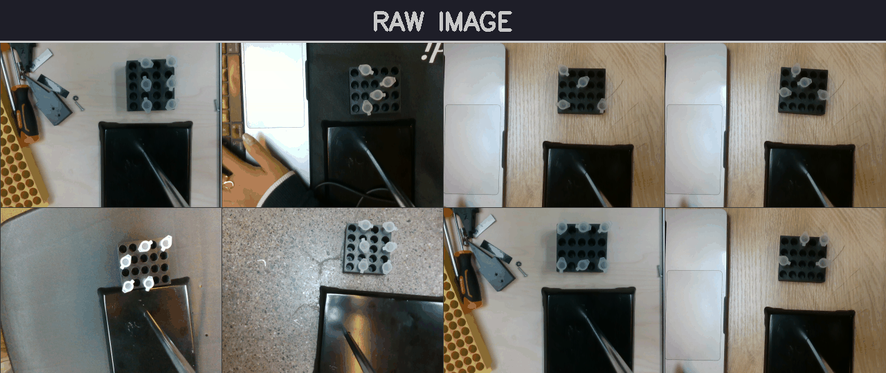
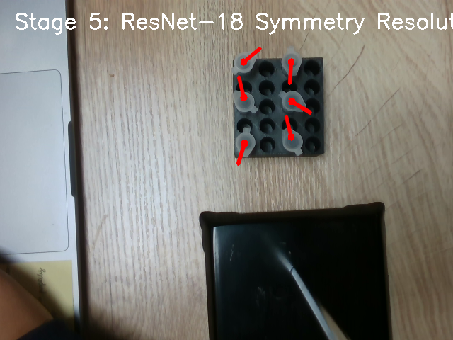

# Tube Detection & Orientation Pipeline

## 1. Introduction

I approached the problem statement by breaking down the requirements for a successful orientation of a given overhead image into 5 logical steps:

*   **Step 1:** How do we locate the tubes?
*   **Step 2:** We have located the tubes, now how do we center and focus on exactly the cross section of the tube most relevant to us?
*   **Step 3:** How do we use this cutout to find the orientation of the said tube?
*   **Step 4:** How can we refine the cutout to further improve the results from step 3?
*   **Step 5:** Are we pointing in the right direction tho? How do we make sure we are not pointing towards the lid joint instead of pointing correctly towards the lid tab?

Hence, through all my iterations I have tried to refine and obtain better inputs for all of these steps. I started out with just a simple YOLOv8n model, then transitioned to an OBB model to get better bounding boxes. I further refined the bounding boxes with MobileSAM to get even more tighter and precise cutouts for better angular prediction. I finally settled on SAM box prompting based on a YOLO11s-Pose model, which gave the tightest and most accurate cutouts for the required region, giving the best MAE in my experiments. 

For flip differences, I first tried an SVM-based classifier trained using the ResNet features of tabs and joints to differentiate between them and orient the PCA axis mathematically accordingly. But finally, I settled on using the pose-estimated angle as a proxy along with the PCA to get the final angle. This has basically been my approach and technical evolution of the approaches tried, and my rationale for doing so. Hope you enjoy going through my work, just as much I enjoyed experimenting and working on it!
> [!NOTE]
> Please find the detailed report with my analysis on the pipeline used, benchmarks, metrics etc. in the [report](./report.pdf) in this repository.


## 2. Performance Metrics (5-Fold CV)

The final pipeline achieves sub-3 degree accuracy, evaluated rigorously across all 371 ground-truth tubes using 5-Fold Cross-Validation.

| Metric | Value |
| :--- | :--- |
| **Mean Angle Error (MAE)** | **2.86°** |
| **Median Angle Error** | **2.14°** |
| **Accuracy < 5°** | **84.6%** |
| **Accuracy < 10°** | **97.0%** |
| **Flip Failures** | **0.00%** |
| **Precision / Recall** | **100% / 100%** |

## 3. Directory Structure
```
.
├── app.py                   # Comparative evaluation dashboard
├── reproduce.sh             # End-to-end reproduction script
├── report.tex               # Technical methodology report
├── annotations.csv          # Ground truth data
├── models/                  # Model weights (YOLO11-Pose & MobileSAM)
├── scripts/                 # Training and evaluation scripts
└── utils/                   # Shared utility modules
```

## 5. How to Reproduce
To retrain the models and run the full 5-fold cross-validation audit:


```bash
pip install -r requirements.txt
chmod +x reproduce.sh
bash reproduce.sh
```

To run the comparative audit dashboard:
```bash
streamlit run app.py
```

## 6. Pipeline in Action



## 7. Final Predictions



## 8. AI Usage 

AI coding assistants were used throughout development for:
Code scaffolding: Boilerplate for YOLO training loops, data preparation, and Streamlit UI.
Documentation: Drafting LaTeX report structure and markdown documentation.
All technical decisions (pipeline architecture, the SAM + PCA moments approach, the ResNet-SVM flip resolution strategy etc.) and the written analysis are my own.
